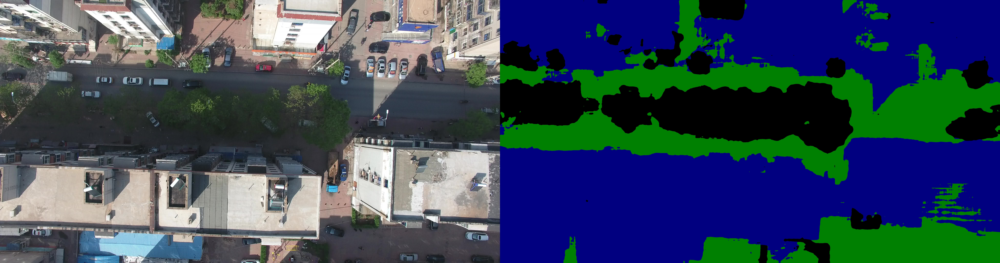

# 葫芦岛数据集房屋边缘提取

## 已有在PSSD上训练好的模型，对葫芦岛数据集的处理步骤如下：
```
1. 预测、形态学处理 —— 得到建筑物mask
2. mask、原图canny进行与操作、形态学处理 —— 得到最终的边缘
```

## 1 建筑物mask获得

- ### 1.1 deeplab预测结果



- ### 1.2 将其二值化(白色为建筑，黑色为植被+其他)：


- ### 1.3 去除小型色块噪声，进行补洞后的结果：


## 2 mask、原图canny进行与操作

- ### 2.1 原图canny：


- ### 2.2 与操作后的结果(1.3与2.1)：


- ### 2.3 对mask过的canny进行形态学处理：


## 更多结果

- #### 000349:


- #### 000386:


