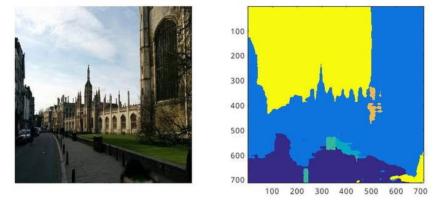
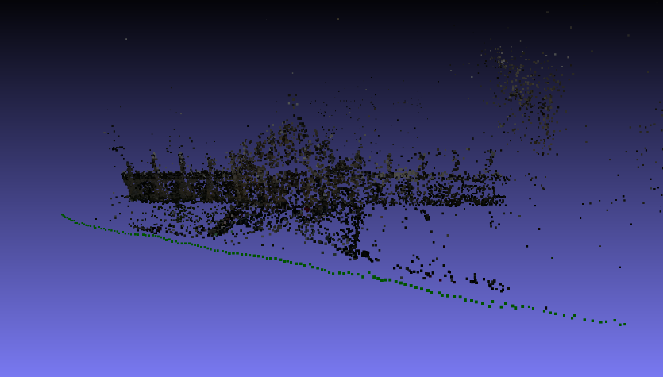
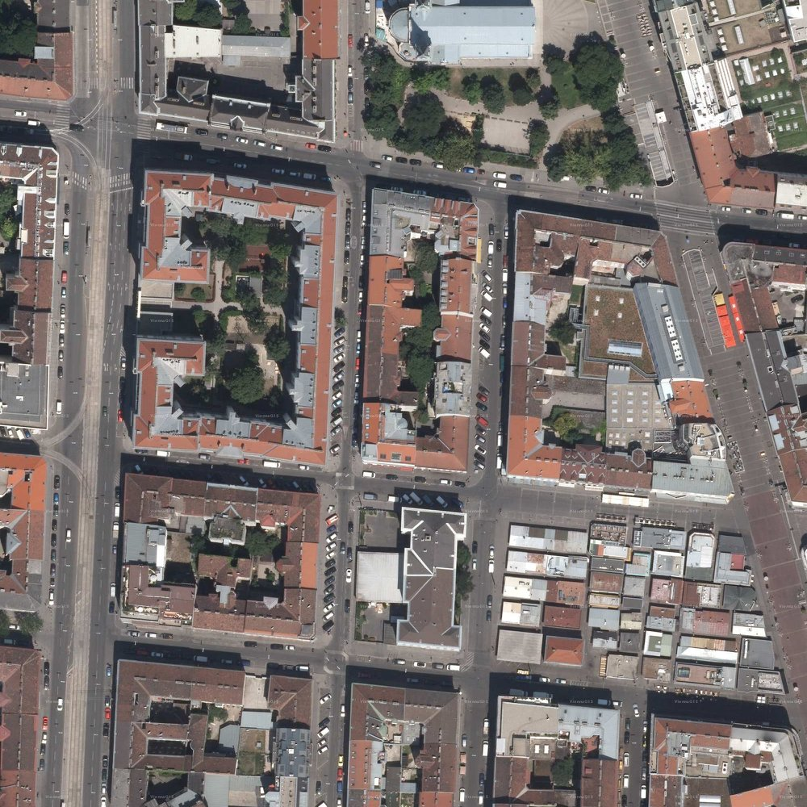
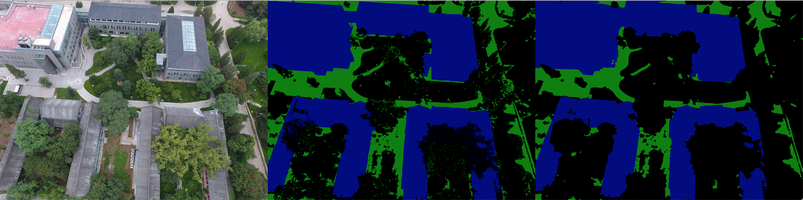
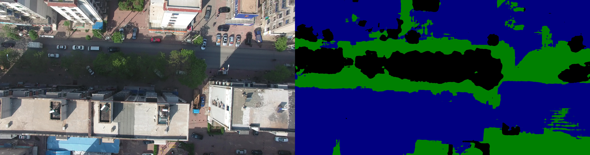

# 无人机航拍场景的三维重建数据集(SFM Semantic Dataset)构建

## 0. 任务背景
**较为成熟的室外场景数据集主要包括两种：街景与卫星**

较为成熟的室外场景数据集主要包括两种：街景与卫星。街景数据集一般由固定在车辆上的摄像机拍摄生成，主要应用于无人驾驶领域，因此主要是城市道路。卫星数据集顾名思义是卫星拍摄的图像。这二者对于室外场景，尤其是对建筑的刻画都不够完全，因此都不能单独用作三维重建。

fig.1(a) 伦敦国王大学街拍数据集

fig.1(b) 伦敦国王大学街拍场景重建出来的三维点云，建筑的顶面并没有被建出来

fig.2 INRIA卫星数据集，建筑的立面不在图像中

而对于大规模场景三维重建任务，无人机航拍图像必然是最合适的。搭载在无人机上的相机可以同时拍摄到建筑物的顶面与立面，且可以对目标场景快速获取大量数据。我们图形学与交互实验室先前采集的北大航拍影像有几千张，其分辨率较高(4000*3000)，且拍摄间隔较为紧凑，是很好的三维重建数据集。

同时，走通三维语义模型的构建，将有如下两个主要意义：
1. 将三维语义模型重投影，可以得到带语义的二维仿真图像，当我们的模型构建足够准确，将节约大量的人工标注成本
2. 对于三维重建任务，语义信息也能够优化匹配效率与结果、修正三维模型

## 1. 当前情况

我们已将之前无人机拍摄的m1部分([PKU SFM Semantic image Dataset(PSSD)](https://github.com/PKUGIL/PSSI))标注完成，共288张。其中的200张用作train set，40张validation set，剩余44张作为test set。
 

fig.3 在PSSD的test集上的预测结果(中间是ground truth，右侧是预测)

目前我们遇到了如下两个难题：其一，已有的北大数据集在分布上过于单一，导致训练出来的模型在其他无人机航拍场景中泛化能力差。

fig.3 在葫芦岛数据集上的预测结果(无ground truth)

其二，根据我们的调研，目前没有公开的带有精细标注的无人机航拍数据集(拍摄地表距离在400米以下)，也就是说如果想进一步提高模型的泛化能力，需要我们标记更多数据。综合以上两点，我们决定在目前已有的航拍图像数据集基础上进行扩充，建立第一个带有精细标注、可作为无人机场景benchmark的数据集。

## 2. 数据集构建计划

我们分析得出影响无人机航拍图像语义分割性能的主要三个因素如下：
1. 场景内容
2. 拍摄高度
3. 光照(阴影)

### 接下来的工作
- 与吕洪等同学进行沟通，确认实验室已有航拍数据能够涵盖的场景、高度、光照情况
- 对未涵盖到的场景、高度、光照场景进行补充拍摄
- 完成不少于7类的语义标注(建筑、植被、地面、水面、汽车、自行车、行人)
