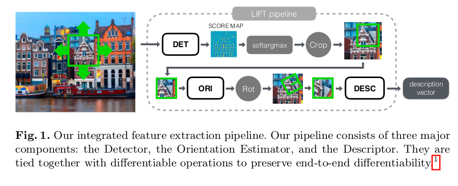
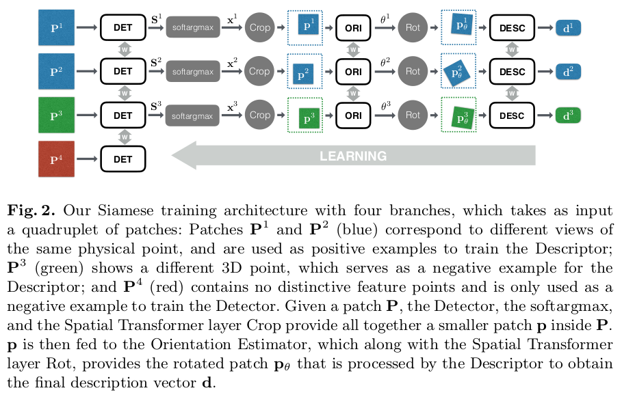

# Learned Invariant Feature Transform

- [https://arxiv.org/pdf/1603.09114.pdf](paper)
- [github resource](https://github.com/cvlab-epfl/LIFT.git)

## Introduction

The architecture of LIFT

- All based on Convolutional Neural Networks (CNNs)
- To mesh them together we use Spatial Transformers to rectify the image patches given the output of the Detector and the Orientation Estimator.

- maximum suppression (NMS) are replaced by the soft argmax function [12]. --- This allows us to preserve end-to-end differentiability, and results in a full network that can still be trained with back-propagation, which is not the case of any other architecture we know of.

## Method

### Problem Formulation

- input: image patches

Siamese network architecture

