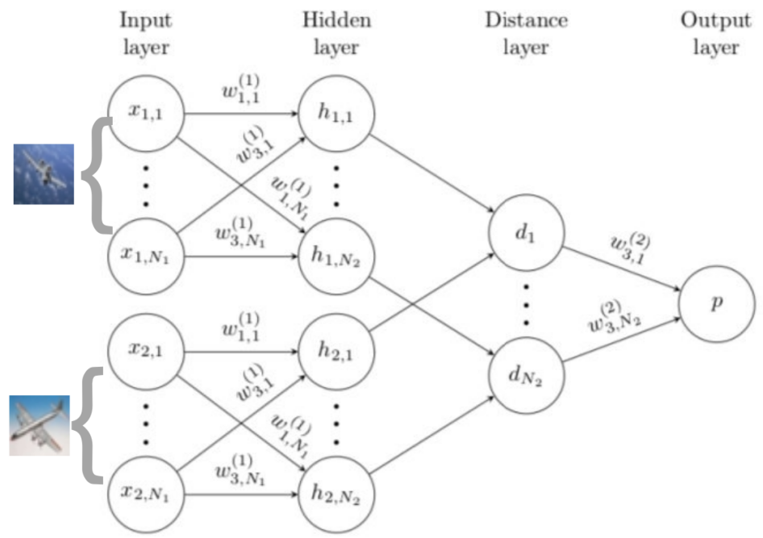
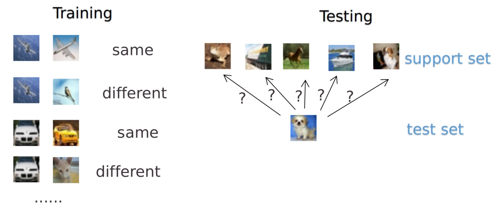
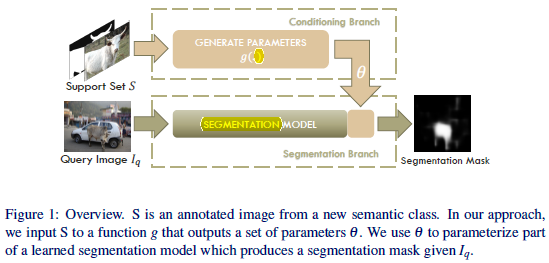

# one-shot learning for semantic segmentation

## Related work
- Semantic Image segmentation
- Weak Supervison
- Few-Shot Learning

## baseline: Siamsee Network

这个方法对输入的结构进行限制并自动发现可以从新样本上泛化的特征。通过一个有监督的基于孪生网络的度量学习来训练，然后重用那个网络所提取的特征进行one/few-shot学习。
  它是一个双路的神经网络，训练时，通过组合不同类的样本成对，同时输入网络进行训练，在最上层通过一个距离的交叉熵进行loss的计算。

  在预测的时候，以5way-5shot为例，从5个类中随机抽取5个样本，把这个mini-batch=25的数据输入网络，最后获得25个值，取分数最高对应的类别作为预测结果。

## Proposed model

two-branched approach to one-shot semantic image segmentation. The first branch takes the labeled image as input and produces a vector of parameters as output. The second branch takes these parameters as well as a new image as input and produces a segmentation mask of the image for the new class as output.

### Conditioning Branch
- no fine-tuning, just forward
- parameters independent of image size

### Benchmark:PASCAL-$5^i$
- 20 classes
