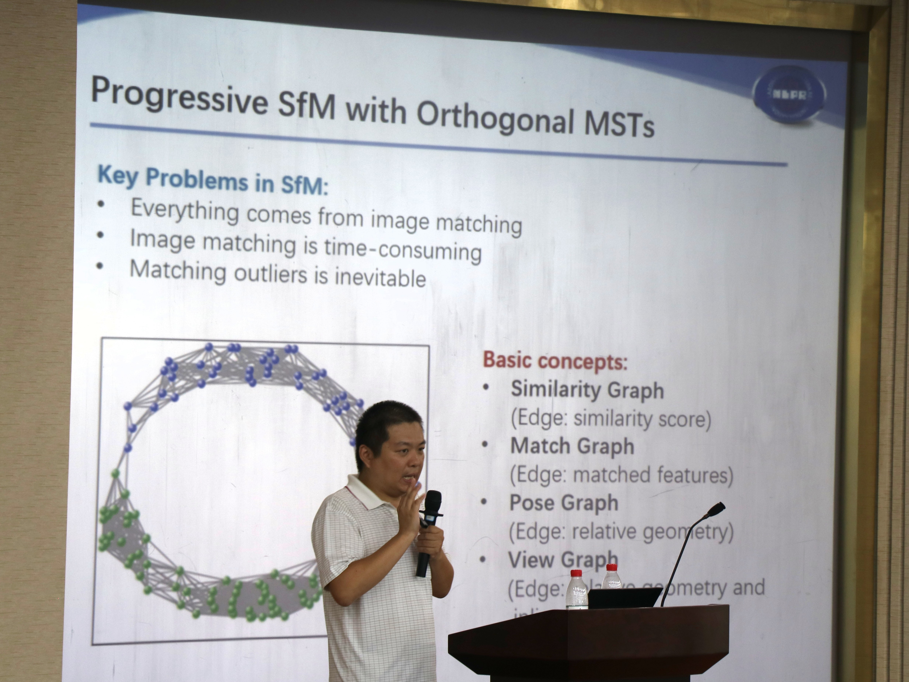
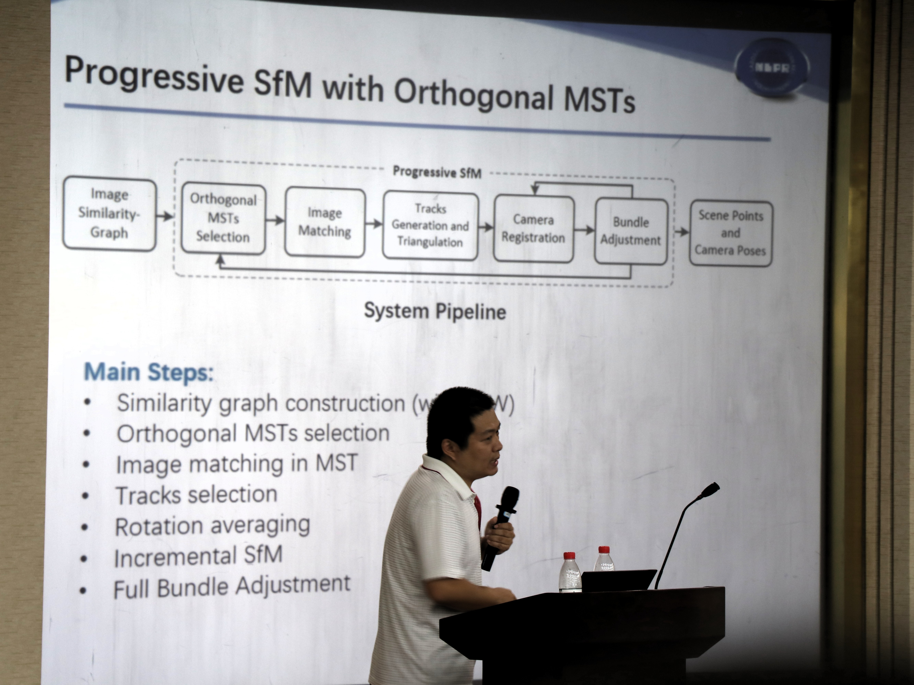
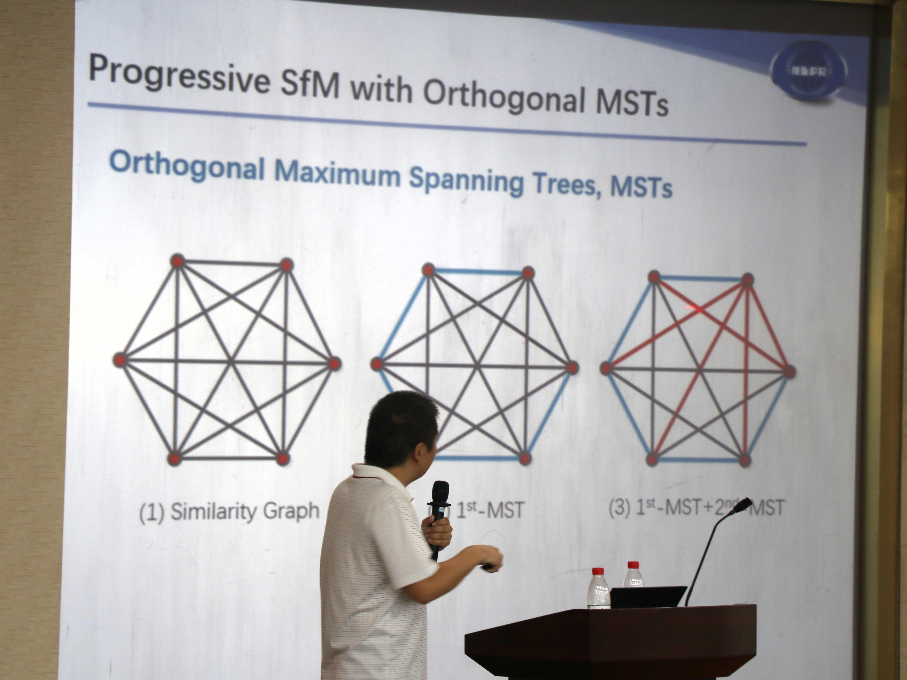
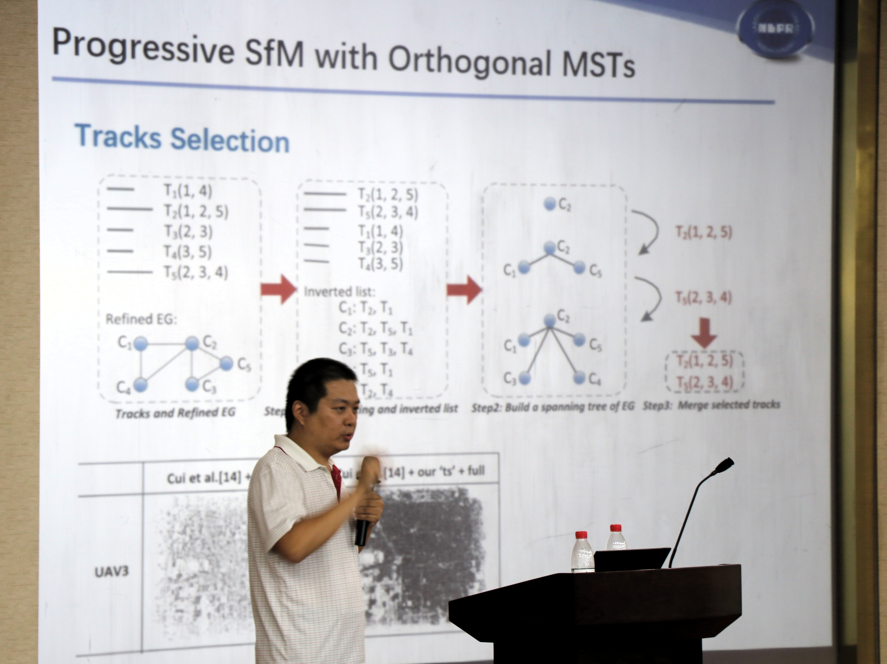
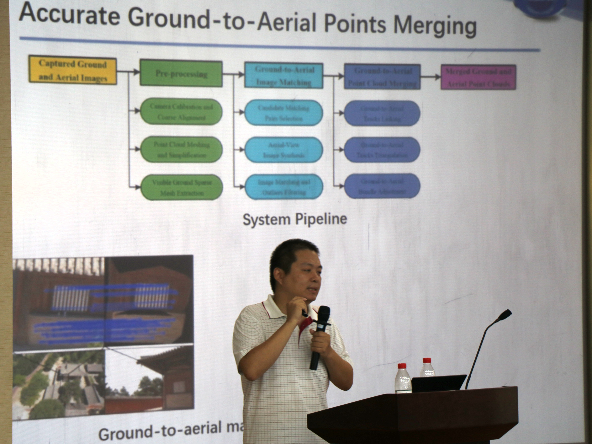
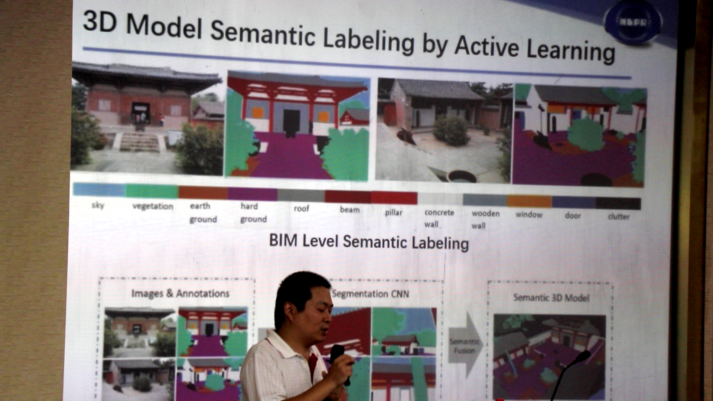
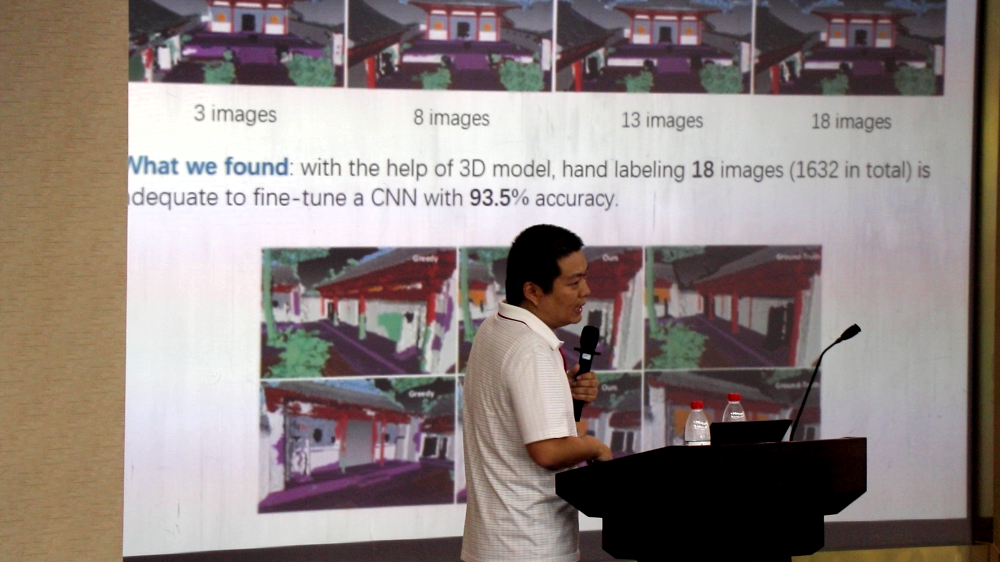
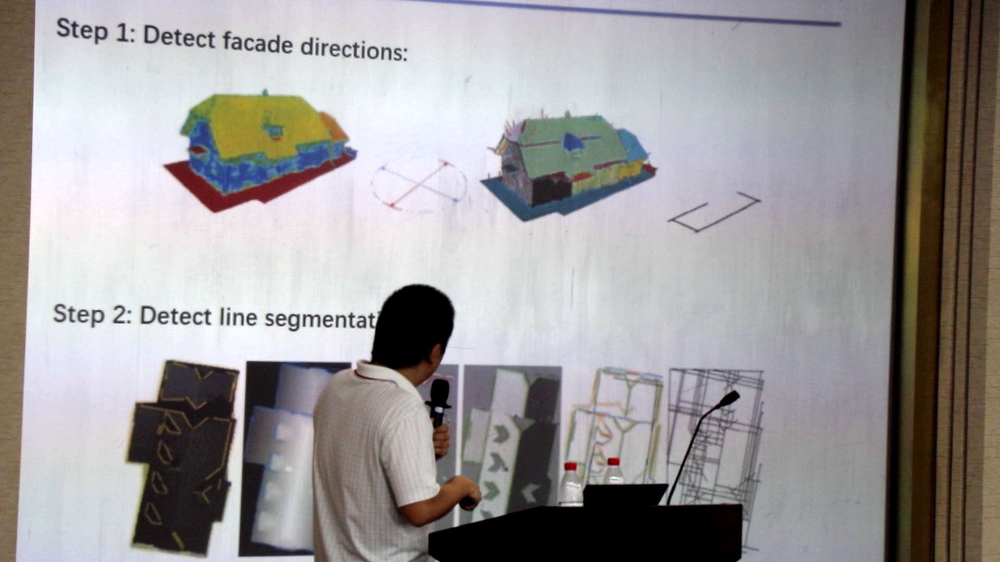
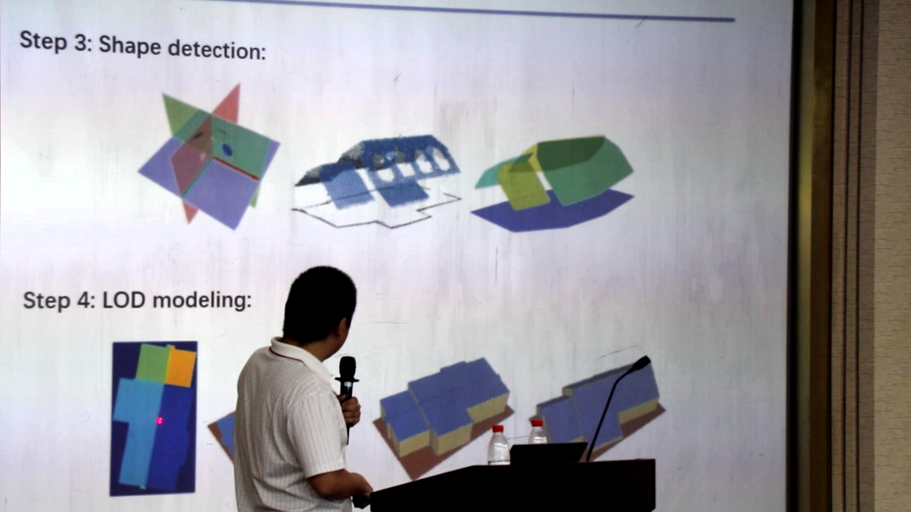

# 基于图像的大规模场景三维建模
- 报告人：中科院自动化研究所　申抒含

视频序列＋离线处理

|slam(optimization)|SfM(incremental)|
|---|---|
|Local Matching|Full Matching|
|PnP+Triangulation|Seed Selection|
|Local Bundle Adjustment|Two View Reconstruction|
|Loop Closure|PnP+Triangulation|
|Pose Graph Optimization|Local Bundle Adjustment|
|Full Bundle Adjustment|Full Bundle Adjustment|

## 图像三维重建基本流程
多视角图像——>稀疏点云重建——>稠密点云重建——>点云语义分割——>部件语义建模——>三维语义模型

图像——>稀疏点云——>稠密点云——>语义点云——>部件模型——>整体语义模型

## Progressive SfM with Orthogonal MSTs

> Progressive Large-Scale Structure-from-Motion with Orthogonal MSTs. 3DV 2018

> HSfM:Hybird Structure-from-Motion, CVPR 2017

> Batched Incremental Structure-from-Motion, 3DV 2017

> Tracks Selection for Robust, Efficient and Scalable Large-Scale Stucture from Motion. Pattern Recognition, 2017

|SfM with Orthogonal MSTs|
|---|
|Similarity graph construction|
|Orthogonal MSTs selection|
|Image matching in MST|
|Tracks selection|
|Rotation averaging|
|Incremental SfM|
|Full Bundle Adjustment|

这部分工作主要是利用视点图(View Graph)的正交最小生成树对渐进式SfM的优化(track)

## Accurate Ground-to-Aerial Points Merging

> Ancient Chinese Architecture 3D Preservation by Merging Ground and Aerial Point Clouds.

> Accurate and Efficient Ground-to-Aerial Model Alignment

由于地面图像和航拍图像在视点和尺度上差异较大，直接使用SIFT等匹配方法效果不好，这部分工作的目的是更好的融合地面和航拍图像得到的点云

## 3D Model Semantic Labeling by Active Learning(主动学习)

> Fine-Level Semantic Labeling of Large-Scale 3D Model by Active Learning, 3DV 2018

当标注类别非常多(12类)的时候，标注成本极高。如果能用三维模型(高精度)指导二维分割，能够巨量减少人力成本。

### 工作流程：
**Images & Annotations** —Fine tuning—> **Segmentation CNN**　—Semantic Fution—> **Semantic 3D Model**

### Basic Idea:
- Fine tuning a trained segmentation CNN(Deeplab V2 trained on COCO)
- Selecting as few images as possible for human annotation with Active Learning
- Using the merged semantic 3D model as a week supervisor

### Batch Images Selection Criterial:
- Observation uncertainty: images are hard to segmentation
- Obervatation divergence: images are different
- The 3D model playing important role in batch images selection

1632的数据集，标注18张(1%的标注量)，能够得到93.5%的精度；而手工标注150张(10%的标注量)，效果竟然不如active learning

## Large Scale Urban Scene Modeling from MVS Meshes

> Large Scale Urban Scene Modeling from MVS Meshes. ECCV 2018
> Variational Building Modeling from Urban MVS Meshes. 3DV 2017

模型简化，90%的压缩率，符合建筑标准：CityGML(LOD 0-3)

input:MVS Meshes(94M Faces)  ——> output:LOD2 Model(0.79M Faces)
